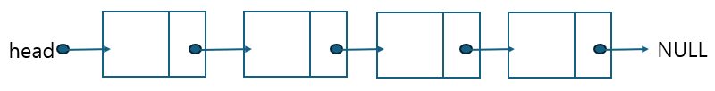

# 리스트 (List)


● 데이터를 순차적으로 저장하는 선형 데이터 구조임

## 배열 (Array)

● 데이터를 연속된 메모리 공간에 저장함

### 고정 크기 배열 (Fixed-size Array)

● 정의

○ 고정된 크기의 메모리를 미리 할당받아 크기를 변경할 수 없는 배열임

● 특징

○ 인덱스를 이용한 데이터 접근이 빠름 (O(1))

○ 크기가 고정되어 동적 메모리 할당이 불필요함

● 동작방식

○ 배열 생성 시 메모리 공간을 한 번에 할당함

○ 데이터는 인덱스를 통해 접근함

● 장단점

○ 장점: 빠른 인덱싱, 메모리 낭비가 적음

○ 단점: 크기 변경 불가능, 데이터 추가/삭제 비효율적 (O(n))

● 활용

○ 데이터 크기가 고정적인 경우 (ex. 2D 좌표 배열, 행렬 계산)

```c
#include <stdio.h>
void fixedSizeArrayExample() {
    int arr[5] = {1, 2, 3, 4, 5};
    for (int i = 0; i < 5; i++) {
        printf("%d ", arr[i]);
    }
}
```
```java
public class FixedSizeArrayExample {
    public static void main(String[] args) {
        int[] arr = {1, 2, 3, 4, 5};
        for (int num : arr) {
            System.out.print(num + " ");
        }
    }
}
```

### 동적 배열 (Dynamic Array)

● 정의

○ 필요에 따라 크기를 동적으로 조정할 수 있는 배열임

● 특징

○ 크기 제한이 없으며 데이터를 추가할 때 자동으로 크기를 확장함

● 동작방식

○ 배열이 가득 찰 경우 두 배 크기의 새 배열을 생성하고 기존 데이터를 복사함

● 장단점

○ 장점: 크기 유연성, 데이터 추가/삭제 용이

○ 단점: 크기 확장 시 복사 비용 발생, 메모리 사용 증가 가능

● 활용

○ 동적 리스트 (ex. Python의 리스트, Java의 ArrayList)
```c
#include <stdio.h>
#include <stdlib.h>
void dynamicArrayExample() {
    int *arr = malloc(3 * sizeof(int));
    arr[0] = 1; arr[1] = 2; arr[2] = 3;
    for (int i = 0; i < 3; i++) {
        printf("%d ", arr[i]);
    }
    free(arr);
}
```
```java
import java.util.ArrayList;
public class DynamicArrayExample {
    public static void main(String[] args) {
        ArrayList<Integer> list = new ArrayList<>();
        list.add(1);
        list.add(2);
        list.add(3);
        for (int num : list) {
            System.out.print(num + " ");
        }
    }
}
```
## 연결 리스트 (Linked List)

● 각 노드가 데이터를 저장하며 포인터를 통해 연결됨

### 단일 연결 리스트 (Singly-Linked List)


● 정의

○ 각 노드가 데이터를 저장하며 다음 노드의 주소를 가리키는 포인터를 가진 구조임

● 특징

○ 노드가 순차적으로 연결되어 있음

○ 크기가 유동적이고 메모리 효율적임

● 동작방식

○ 삽입/삭제 시 포인터를 수정하여 연결을 유지함

● 장단점

○ 장점: 동적 크기, 삽입/삭제가 빠름 (O(1) 또는 O(n))

○ 단점: 인덱스 접근 비효율적 (O(n)), 추가 포인터로 인한 메모리 오버헤드 발생

● 활용

○ 메모리가 제한적이고 데이터 크기가 가변적인 상황
```c
#include <stdio.h>
#include <stdlib.h>
struct Node {
    int data;
    struct Node* next;
};
void printList(struct Node* n) {
    while (n != NULL) {
        printf("%d ", n->data);
        n = n->next;
    }
}
```
```java
class SinglyLinkedList {
    class Node {
        int data;
        Node next;

        Node(int data) {
            this.data = data;
        }
    }

    Node head;

    void insert(int data) {
        Node newNode = new Node(data);
        if (head == null) {
            head = newNode;
        } else {
            Node temp = head;
            while (temp.next != null) {
                temp = temp.next;
            }
            temp.next = newNode;
        }
    }

    void display() {
        Node temp = head;
        while (temp != null) {
            System.out.print(temp.data + " ");
            temp = temp.next;
        }
    }
}

public class TestSinglyLinkedList {
    public static void main(String[] args) {
        SinglyLinkedList list = new SinglyLinkedList();
        list.insert(10);
        list.insert(20);
        list.insert(30);
        list.display();
    }
}
```

### 이중 연결 리스트 (Doubly-Linked List)


● 정의

○ 각 노드가 이전 및 다음 노드의 포인터를 가진 구조임

● 특징

○ 양방향 순회 가능

● 동작방식

○ 삽입/삭제 시 두 포인터를 수정함

● 장단점

○ 장점: 양방향 탐색 가능, 특정 위치 데이터 삽입/삭제 효율적

○ 단점: 포인터 관리 복잡, 추가 메모리 사용

● 활용

○ 양방향 탐색이 필요한 경우 (ex. 브라우저 뒤로/앞으로 이동)
```c
#include <stdio.h>
#include <stdlib.h>
struct DNode {
    int data;
    struct DNode *prev, *next;
};
void printDList(struct DNode* n) {
    while (n != NULL) {
        printf("%d ", n->data);
        n = n->next;
    }
}
```
```java
class DoublyLinkedList {
    class Node {
        int data;
        Node prev, next;

        Node(int data) {
            this.data = data;
        }
    }

    Node head;

    void insert(int data) {
        Node newNode = new Node(data);
        if (head == null) {
            head = newNode;
        } else {
            Node temp = head;
            while (temp.next != null) {
                temp = temp.next;
            }
            temp.next = newNode;
            newNode.prev = temp;
        }
    }

    void display() {
        Node temp = head;
        while (temp != null) {
            System.out.print(temp.data + " ");
            temp = temp.next;
        }
    }
}

public class TestDoublyLinkedList {
    public static void main(String[] args) {
        DoublyLinkedList list = new DoublyLinkedList();
        list.insert(10);
        list.insert(20);
        list.insert(30);
        list.display();
    }
}
```
### 원형 연결 리스트 (Circular-Linked List)


● 정의

○ 마지막 노드가 첫 번째 노드를 가리키는 구조임

● 특징

○ 순환 구조로 연속적 데이터 처리가 가능

● 동작방식

○ 삽입/삭제 시 포인터를 순환 구조로 유지함

● 장단점

○ 장점: 순환 데이터 처리에 적합

○ 단점: 구현 복잡성 증가

● 활용

○ 자원 스케줄링 (ex. 운영체제의 CPU 스케줄링)
```c
#include <stdio.h>
#define SIZE 5
int queue[SIZE];
int front = -1, rear = -1;

void enqueue(int element) {
    if ((rear + 1) % SIZE == front) {
        printf("Queue is full\n");
    } else {
        if (front == -1) front = 0;
        rear = (rear + 1) % SIZE;
        queue[rear] = element;
    }
}

void display() {
    if (front == -1) {
        printf("Queue is empty\n");
        return;
    }
    int i = front;
    while (1) {
        printf("%d ", queue[i]);
        if (i == rear) break;
        i = (i + 1) % SIZE;
    }
}
```
```java
class CircularQueue {
    int[] queue;
    int front, rear, size;

    CircularQueue(int size) {
        this.size = size;
        queue = new int[size];
        front = rear = -1;
    }

    void enqueue(int element) {
        if ((rear + 1) % size == front) {
            System.out.println("Queue is full");
        } else {
            if (front == -1) front = 0;
            rear = (rear + 1) % size;
            queue[rear] = element;
        }
    }

    void display() {
        if (front == -1) {
            System.out.println("Queue is empty");
            return;
        }
        int i = front;
        while (true) {
            System.out.print(queue[i] + " ");
            if (i == rear) break;
            i = (i + 1) % size;
        }
    }
}

public class TestCircularQueue {
    public static void main(String[] args) {
        CircularQueue cq = new CircularQueue(5);
        cq.enqueue(10);
        cq.enqueue(20);
        cq.enqueue(30);
        cq.display();
    }
}
```
### 다중 연결 리스트 (Multi-Linked List)

● 정의

○ 각 노드가 여러 개의 포인터를 가지고 다양한 방향으로 연결되는 구조임

● 특징

○ 복잡한 관계 데이터를 표현 가능

● 동작방식

○ 각 포인터를 이용해 여러 방향으로 데이터 연결

● 장단점

○ 장점: 다양한 연결 관계 표현 가능

○ 단점: 구현 복잡, 높은 메모리 사용량 발생

● 활용

○ 그래프, 관계형 데이터베이스

---

# 스택 (Stack)

● LIFO (Last In, First Out) 방식의 데이터 구조임

## 배열 기반 스택 (Array-based Stack)


● 정의

○ 배열을 사용하여 스택을 구현함

● 특징

○ 데이터 삽입(Push)과 삭제(Pop)는 한쪽에서만 이루어짐

● 동작방식

○ Push: 데이터 추가 후 Top 증가

○ Pop: 데이터 제거 후 Top 감소

● 장단점

○ 장점: 간단한 구현, 빠른 데이터 접근

○ 단점: 크기 제한, 배열 크기 확장 비용 발생

● 활용

○ 함수 호출 스택, undo/redo 기능
```c
#include <stdio.h>
#include <stdlib.h>

#define MAX 100

typedef struct {
    int data[MAX];
    int top;
} Stack;

void init(Stack *s) {
    s->top = -1;
}

int isFull(Stack *s) {
    return s->top == MAX - 1;
}

int isEmpty(Stack *s) {
    return s->top == -1;
}

void push(Stack *s, int value) {
    if (isFull(s)) {
        printf("Stack Overflow\n");
        return;
    }
    s->data[++(s->top)] = value;
}

int pop(Stack *s) {
    if (isEmpty(s)) {
        printf("Stack Underflow\n");
        return -1;
    }
    return s->data[(s->top)--];
}

int main() {
    Stack s;
    init(&s);
    push(&s, 10);
    push(&s, 20);
    printf("Popped: %d\n", pop(&s));
    return 0;
}
```
```java
class ArrayStack {
    private int[] stack;
    private int top;
    private int max;

    public ArrayStack(int size) {
        max = size;
        stack = new int[max];
        top = -1;
    }

    public boolean isFull() {
        return top == max - 1;
    }

    public boolean isEmpty() {
        return top == -1;
    }

    public void push(int value) {
        if (isFull()) {
            System.out.println("Stack Overflow");
            return;
        }
        stack[++top] = value;
    }

    public int pop() {
        if (isEmpty()) {
            System.out.println("Stack Underflow");
            return -1;
        }
        return stack[top--];
    }

    public static void main(String[] args) {
        ArrayStack stack = new ArrayStack(5);
        stack.push(10);
        stack.push(20);
        System.out.println("Popped: " + stack.pop());
    }
}
```
## 연결 리스트 기반 스택 (Linked List-based Stack)


● 정의

○ 연결 리스트로 구현된 스택임

● 특징

○ 데이터 크기에 제한이 없음

● 동작방식

○ Push: 새로운 노드를 Top으로 설정

○ Pop: Top 노드 제거 후 다음 노드를 Top으로 설정

● 장단점

○ 장점: 크기 제한 없음, 동적 메모리 사용 가능

○ 단점: 추가 포인터로 인한 메모리 오버헤드 발생

● 활용

○ 동적 데이터 처리
```c
#include <stdio.h>
#include <stdlib.h>

typedef struct Node {
    int data;
    struct Node *next;
} Node;

typedef struct {
    Node *top;
} Stack;

void init(Stack *s) {
    s->top = NULL;
}

int isEmpty(Stack *s) {
    return s->top == NULL;
}

void push(Stack *s, int value) {
    Node *newNode = (Node *)malloc(sizeof(Node));
    newNode->data = value;
    newNode->next = s->top;
    s->top = newNode;
}

int pop(Stack *s) {
    if (isEmpty(s)) {
        printf("Stack Underflow\n");
        return -1;
    }
    Node *temp = s->top;
    int value = temp->data;
    s->top = s->top->next;
    free(temp);
    return value;
}

int main() {
    Stack s;
    init(&s);
    push(&s, 10);
    push(&s, 20);
    printf("Popped: %d\n", pop(&s));
    return 0;
}
```
```java
class Node {
    int data;
    Node next;

    Node(int data) {
        this.data = data;
        this.next = null;
    }
}

class LinkedListStack {
    private Node top;

    public LinkedListStack() {
        this.top = null;
    }

    public boolean isEmpty() {
        return top == null;
    }

    public void push(int value) {
        Node newNode = new Node(value);
        newNode.next = top;
        top = newNode;
    }

    public int pop() {
        if (isEmpty()) {
            System.out.println("Stack Underflow");
            return -1;
        }
        int value = top.data;
        top = top.next;
        return value;
    }

    public static void main(String[] args) {
        LinkedListStack stack = new LinkedListStack();
        stack.push(10);
        stack.push(20);
        System.out.println("Popped: " + stack.pop());
    }
}
```
## 최소값/최대값 추적 스택 (Min/Max Stack)

● 정의

○ 현재 스택에서 최소값/최대값을 추적하는 구조임

● 특징

○ 추가 데이터 구조(보조 스택)를 사용해 최소/최대값 관리

● 동작방식

○ Push/Pop 시 보조 스택 업데이트

● 장단점

○ 장점: 최소/최대값 조회가 O(1)로 빠름

○ 단점: 보조 스택으로 인한 메모리 사용 증가

● 활용

○ 최적화된 데이터 처리
```c
#include <stdio.h>
#include <stdlib.h>

#define MAX 100

typedef struct {
    int data[MAX];
    int min[MAX];
    int top;
} MinStack;

void init(MinStack *s) {
    s->top = -1;
}

int isFull(MinStack *s) {
    return s->top == MAX - 1;
}

int isEmpty(MinStack *s) {
    return s->top == -1;
}

void push(MinStack *s, int value) {
    if (isFull(s)) {
        printf("Stack Overflow\n");
        return;
    }
    s->data[++(s->top)] = value;
    if (s->top == 0 || value < s->min[s->top - 1]) {
        s->min[s->top] = value;
    } else {
        s->min[s->top] = s->min[s->top - 1];
    }
}

int pop(MinStack *s) {
    if (isEmpty(s)) {
        printf("Stack Underflow\n");
        return -1;
    }
   
```
```java
import java.util.Stack;

class MinStack {
    private Stack<Integer> stack;
    private Stack<Integer> minStack;

    public MinStack() {
        stack = new Stack<>();
        minStack = new Stack<>();
    }

    public void push(int value) {
        stack.push(value);
        if (minStack.isEmpty() || value <= minStack.peek()) {
            minStack.push(value);
        }
    }

    public int pop() {
        if (stack.isEmpty()) {
            System.out.println("Stack Underflow");
            return -1;
        }
        int value = stack.pop();
        if (value == minStack.peek()) {
            minStack.pop();
        }
        return value;
    }

    public int getMin() {
        if (minStack.isEmpty()) {
            System.out.println("Stack is empty");
            return -1;
        }
        return minStack.peek();
    }

    public static void main(String[] args) {
        MinStack stack = new MinStack();
        stack.push(10);
        stack.push(20);
        stack.push(5);
        System.out.println("Minimum: " + stack.getMin());
        stack.pop();
        System.out.println("Minimum: " + stack.getMin());
    }
}
```
---

# 큐 (Queue)

● FIFO (First In, First Out) 방식의 데이터 구조임

## 배열 기반 큐 (Array-based Queue)


● 정의

○ 배열을 사용하여 구현된 큐임

● 특징

○ 인덱스가 순차적으로 이동함

● 동작방식

○ Enqueue: Rear에 데이터 추가

○ Dequeue: Front에서 데이터 제거

● 장단점

○ 장점: 간단한 구현

○ 단점: 배열 크기 제한

● 활용

○ 간단한 데이터 버퍼
```c
#include <stdio.h>
#include <stdlib.h>

#define MAX 100

typedef struct {
    int data[MAX];
    int front;
    int rear;
} Queue;

void init(Queue *q) {
    q->front = 0;
    q->rear = -1;
}

int isFull(Queue *q) {
    return q->rear == MAX - 1;
}

int isEmpty(Queue *q) {
    return q->front > q->rear;
}

void enqueue(Queue *q, int value) {
    if (isFull(q)) {
        printf("Queue Overflow\n");
        return;
    }
    q->data[++(q->rear)] = value;
}

int dequeue(Queue *q) {
    if (isEmpty(q)) {
        printf("Queue Underflow\n");
        return -1;
    }
    return q->data[(q->front)++];
}

int main() {
    Queue q;
    init(&q);
    enqueue(&q, 10);
    enqueue(&q, 20);
    printf("Dequeued: %d\n", dequeue(&q));
    return 0;
}
```
```java
class ArrayQueue {
    private int[] queue;
    private int front, rear, max;

    public ArrayQueue(int size) {
        max = size;
        queue = new int[max];
        front = 0;
        rear = -1;
    }

    public boolean isFull() {
        return rear == max - 1;
    }

    public boolean isEmpty() {
        return front > rear;
    }

    public void enqueue(int value) {
        if (isFull()) {
            System.out.println("Queue Overflow");
            return;
        }
        queue[++rear] = value;
    }

    public int dequeue() {
        if (isEmpty()) {
            System.out.println("Queue Underflow");
            return -1;
        }
        return queue[front++];
    }

    public static void main(String[] args) {
        ArrayQueue queue = new ArrayQueue(5);
        queue.enqueue(10);
        queue.enqueue(20);
        System.out.println("Dequeued: " + queue.dequeue());
    }
}
```
## 순환 큐 (Circular Queue)


● 정의

○ 큐가 배열 끝에 도달하면 다시 처음으로 돌아가는 방식임

● 특징

○ 배열 공간을 효율적으로 사용함

● 동작방식

○ Rear와 Front가 순환 구조로 이동함

● 장단점

○ 장점: 공간 효율성 증가

○ 단점: 구현 복잡성 증가

● 활용

○ 자원 스케줄링
```c
#include <stdio.h>
#include <stdlib.h>

#define MAX 5

typedef struct {
    int data[MAX];
    int front, rear;
} CircularQueue;

void init(CircularQueue *q) {
    q->front = -1;
    q->rear = -1;
}

int isFull(CircularQueue *q) {
    return (q->rear + 1) % MAX == q->front;
}

int isEmpty(CircularQueue *q) {
    return q->front == -1;
}

void enqueue(CircularQueue *q, int value) {
    if (isFull(q)) {
        printf("Queue Overflow\n");
        return;
    }
    if (isEmpty(q)) {
        q->front = q->rear = 0;
    } else {
        q->rear = (q->rear + 1) % MAX;
    }
    q->data[q->rear] = value;
}

int dequeue(CircularQueue *q) {
    if (isEmpty(q)) {
        printf("Queue Underflow\n");
        return -1;
    }
    int value = q->data[q->front];
    if (q->front == q->rear) {
        q->front = q->rear = -1;
    } else {
        q->front = (q->front + 1) % MAX;
    }
    return value;
}

int main() {
    CircularQueue q;
    init(&q);
    enqueue(&q, 10);
    enqueue(&q, 20);
    printf("Dequeued: %d\n", dequeue(&q));
    return 0;
}
```
```java
class CircularQueue {
    private int[] queue;
    private int front, rear, max;

    public CircularQueue(int size) {
        max = size;
        queue = new int[max];
        front = -1;
        rear = -1;
    }

    public boolean isFull() {
        return (rear + 1) % max == front;
    }

    public boolean isEmpty() {
        return front == -1;
    }

    public void enqueue(int value) {
        if (isFull()) {
            System.out.println("Queue Overflow");
            return;
        }
        if (isEmpty()) {
            front = rear = 0;
        } else {
            rear = (rear + 1) % max;
        }
        queue[rear] = value;
    }

    public int dequeue() {
        if (isEmpty()) {
            System.out.println("Queue Underflow");
            return -1;
        }
        int value = queue[front];
        if (front == rear) {
            front = rear = -1;
        } else {
            front = (front + 1) % max;
        }
        return value;
    }

    public static void main(String[] args) {
        CircularQueue queue = new CircularQueue(5);
        queue.enqueue(10);
        queue.enqueue(20);
        System.out.println("Dequeued: " + queue.dequeue());
    }
}
```
## 연결 리스트 기반 큐 (Linked List-based Queue)


● 정의

○ 연결 리스트로 구현된 큐임

● 특징

○ 크기 제한이 없음

● 동작방식

○ Enqueue: 새로운 노드를 Rear에 연결

○ Dequeue: Front 노드를 제거

● 장단점

○ 장점: 동적 크기 지원 가능

○ 단점: 포인터 관리 필요

● 활용

○ 대규모 데이터 처리
```c
#include <stdio.h>
#include <stdlib.h>

typedef struct Node {
    int data;
    struct Node *next;
} Node;

typedef struct {
    Node *front;
    Node *rear;
} Queue;

void init(Queue *q) {
    q->front = q->rear = NULL;
}

int isEmpty(Queue *q) {
    return q->front == NULL;
}

void enqueue(Queue *q, int value) {
    Node *newNode = (Node *)malloc(sizeof(Node));
    newNode->data = value;
    newNode->next = NULL;
    if (isEmpty(q)) {
        q->front = q->rear = newNode;
    } else {
        q->rear->next = newNode;
        q->rear = newNode;
    }
}

int dequeue(Queue *q) {
    if (isEmpty(q)) {
        printf("Queue Underflow\n");
        return -1;
    }
    Node *temp = q->front;
    int value = temp->data;
    q->front = q->front->next;
    free(temp);
    return value;
}

int main() {
    Queue q;
    init(&q);
    enqueue(&q, 10);
    enqueue(&q, 20);
    printf("Dequeued: %d\n", dequeue(&q));
    return 0;
}
```
```java
class Node {
    int data;
    Node next;

    Node(int data) {
        this.data = data;
        this.next = null;
    }
}

class LinkedListQueue {
    private Node front, rear;

    public LinkedListQueue() {
        front = rear = null;
    }

    public boolean isEmpty() {
        return front == null;
    }

    public void enqueue(int value) {
        Node newNode = new Node(value);
        if (isEmpty()) {
            front = rear = newNode;
        } else {
            rear.next = newNode;
            rear = newNode;
        }
    }

    public int dequeue() {
        if (isEmpty()) {
            System.out.println("Queue Underflow");
            return -1;
        }
        int value = front.data;
        front = front.next;
        if (front == null) {
            rear = null;
        }
        return value;
    }

    public static void main(String[] args) {
        LinkedListQueue queue = new LinkedListQueue();
        queue.enqueue(10);
        queue.enqueue(20);
        System.out.println("Dequeued: " + queue.dequeue());
    }
}
```
## 우선순위 큐 (Priority Queue)


● 정의

○ 우선순위를 기준으로 데이터를 처리하는 큐임

### 배열 기반 우선순위 큐

● 특징

○ 우선순위를 위해 정렬 필요

● 장단점

○ 장점: 간단한 구현 가능

○ 단점: 정렬 비용 발생 (O(n))
```c
#include <stdio.h>
#include <stdlib.h>

#define MAX 100

typedef struct {
    int data[MAX];
    int size;
} PriorityQueue;

void init(PriorityQueue *pq) {
    pq->size = 0;
}

int isEmpty(PriorityQueue *pq) {
    return pq->size == 0;
}

int isFull(PriorityQueue *pq) {
    return pq->size == MAX;
}

void enqueue(PriorityQueue *pq, int value) {
    if (isFull(pq)) {
        printf("Queue Overflow\n");
        return;
    }
    int i = pq->size - 1;
    while (i >= 0 && pq->data[i] < value) {
        pq->data[i + 1] = pq->data[i];
        i--;
    }
    pq->data[i + 1] = value;
    pq->size++;
}

int dequeue(PriorityQueue *pq) {
    if (isEmpty(pq)) {
        printf("Queue Underflow\n");
        return -1;
    }
    return pq->data[--(pq->size)];
}

int main() {
    PriorityQueue pq;
    init(&pq);

    enqueue(&pq, 10);
    enqueue(&pq, 20);
    enqueue(&pq, 5);

    printf("Dequeued: %d\n", dequeue(&pq)); // Outputs: 20
    printf("Dequeued: %d\n", dequeue(&pq)); // Outputs: 10

    return 0;
}
```
```java
class PriorityQueue {
    private int[] queue;
    private int size;

    public PriorityQueue(int capacity) {
        queue = new int[capacity];
        size = 0;
    }

    public void enqueue(int value) {
        if (size == queue.length) {
            System.out.println("Queue Overflow");
            return;
        }
        queue[size++] = value;
        for (int i = size - 1; i > 0 && queue[i] > queue[i - 1]; i--) {
            int temp = queue[i];
            queue[i] = queue[i - 1];
            queue[i - 1] = temp;
        }
    }

    public int dequeue() {
        if (size == 0) {
            System.out.println("Queue Underflow");
            return -1;
        }
        return queue[--size];
    }

    public static void main(String[] args) {
        PriorityQueue pq = new PriorityQueue(5);
        pq.enqueue(10);
        pq.enqueue(20);
        pq.enqueue(5);
        System.out.println("Dequeued: " + pq.dequeue());
    }
}
```
### 힙 기반 우선순위 큐


● 특징

○ 힙 자료구조를 사용하여 효율적인 우선순위 관리

● 장단점

○ 장점: 삽입/삭제가 O(log n)으로 빠름

○ 단점: 구현 복잡성 높음

● 활용

○ 작업 스케줄링, 네트워크 라우팅
```c
#include <stdio.h>
#include <stdlib.h>

#define MAX 100

typedef struct {
    int data[MAX];
    int size;
} PriorityQueue;

void init(PriorityQueue *pq) {
    pq->size = 0;
}

int isEmpty(PriorityQueue *pq) {
    return pq->size == 0;
}

int isFull(PriorityQueue *pq) {
    return pq->size == MAX;
}

void heapifyUp(PriorityQueue *pq, int index) {
    while (index > 0) {
        int parent = (index - 1) / 2;
        if (pq->data[index] > pq->data[parent]) {
            int temp = pq->data[index];
            pq->data[index] = pq->data[parent];
            pq->data[parent] = temp;
            index = parent;
        } else {
            break;
        }
    }
}

void heapifyDown(PriorityQueue *pq, int index) {
    int left, right, largest;
    while (1) {
        left = 2 * index + 1;
        right = 2 * index + 2;
        largest = index;

        if (left < pq->size && pq->data[left] > pq->data[largest]) {
            largest = left;
        }
        if (right < pq->size && pq->data[right] > pq->data[largest]) {
            largest = right;
        }
        if (largest != index) {
            int temp = pq->data[index];
            pq->data[index] = pq->data[largest];
            pq->data[largest] = temp;
            index = largest;
        } else {
            break;
        }
    }
}

void enqueue(PriorityQueue *pq, int value) {
    if (isFull(pq)) {
        printf("Queue Overflow\n");
        return;
    }
    pq->data[pq->size] = value;
    heapifyUp(pq, pq->size);
    pq->size++;
}

int dequeue(PriorityQueue *pq) {
    if (isEmpty(pq)) {
        printf("Queue Underflow\n");
        return -1;
    }
    int root = pq->data[0];
    pq->data[0] = pq->data[--(pq->size)];
    heapifyDown(pq, 0);
    return root;
}

int main() {
    PriorityQueue pq;
    init(&pq);

    enqueue(&pq, 10);
    enqueue(&pq, 20);
    enqueue(&pq, 5);

    printf("Dequeued: %d\n", dequeue(&pq)); // Outputs: 20
    printf("Dequeued: %d\n", dequeue(&pq)); // Outputs: 10

    return 0;
}
```
```java
import java.util.PriorityQueue;

public class HeapPriorityQueue {
    public static void main(String[] args) {
        PriorityQueue<Integer> pq = new PriorityQueue<>(); // Min-heap
        pq.add(10);
        pq.add(20);
        pq.add(5);

        System.out.println("Dequeued: " + pq.poll()); // Outputs smallest element
    }
}
```